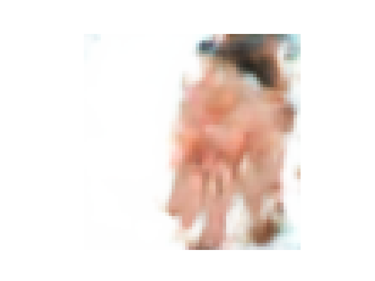
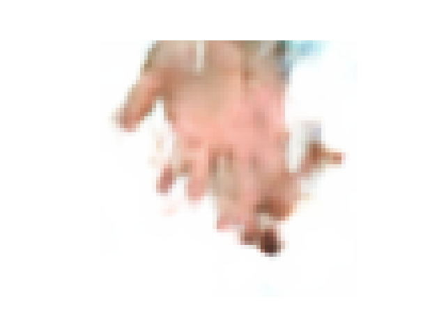

# VAE hands


**Метод генерации изображений ладони, которые могут быть использованы для тренировки моделей 
аутентификации клиентов. Базу данных реальных изображений ладоней для дальнейшей работы нужно 
подготовить самостоятельно**


запуск обучение через:

```
python train_pipeline.py 
```

Inference в ноутбуке **inference.ipynb**

данные лежат:

```
https://www.kaggle.com/datasets/yakorovka/palm-indian/settings
https://www.kaggle.com/datasets/yakorovka/hands-5k/data
```

<div>
  
  
  
  
</div>


ссылка на репо:

https://docs.google.com/presentation/d/1xx1el2dZEFR7OXDHAnN0n4fR89p_eu9QPvuF6MJ4eZE/edit#slide=id.g31f57b478f1_2_34