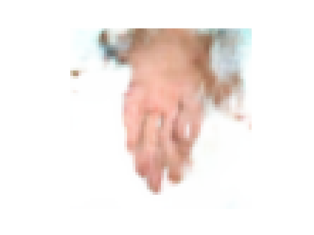
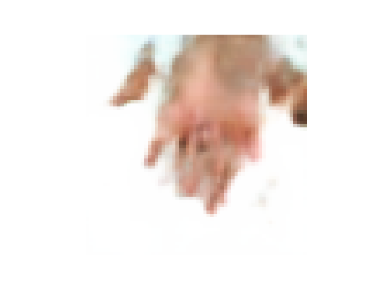

# VAE hands


**Метод генерации изображений ладони, которые могут быть использованы для тренировки моделей 
аутентификации клиентов. Базу данных реальных изображений ладоней для дальнейшей работы нужно 
подготовить самостоятельно**


запуск обучение через:

```
python train_pipeline.py 
```

Inference в ноутбуке **inference.ipynb**

данные лежат:

```
https://www.kaggle.com/datasets/yakorovka/palm-indian/settings
https://www.kaggle.com/datasets/yakorovka/hands-5k/data
```

<div>
  
  
</div>

[comment]: <> (![]&#40;generated_images/generated_image_1.png&#41;)

[comment]: <> (![]&#40;generated_images/generated_image_2.png&#41;)